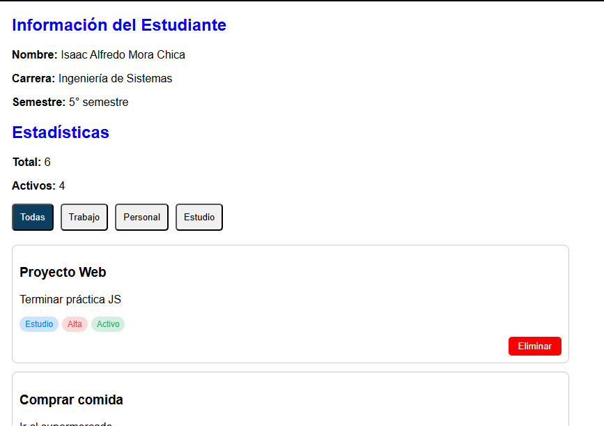
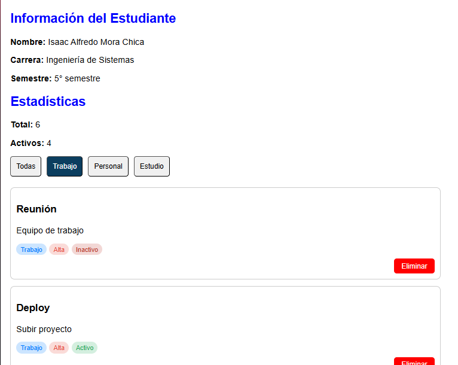

# Práctica DOM Básico

## Descripción de la solución

Esta aplicación web permite gestionar una lista de elementos mediante JavaScript y manipulación del DOM.  
Desde el punto de vista de estilos (CSS), se diseñó una interfaz limpia, organizada y responsive, utilizando clases reutilizables para botones, tarjetas y etiquetas (badges).

Se aplicaron principios de diseño como:
- Uso de flexbox para alineación.
- Espaciado consistente entre componentes.
- Colores semánticos (rojo = alta prioridad, verde = activo).
- Uso de transparencias con `rgba` para mejorar la estética.

---

## Imágenes de la aplicación

### Vista general


### Filtrado aplicado


---

## Fragmentos de código relevantes (CSS)

### Estilo de las tarjetas

```css
.card {
    border: 1px solid #ccc;
    border-radius: 8px;
    padding: 10px;
    margin-bottom: 12px;
}

.btn-eliminar {
    background-color: red;
    color: white;
    border-radius: 5px;
    padding: 6px 14px;
    border: none;
    cursor: pointer;
}

button:hover {
    transform: scale(1.05);
    transition: all 0.2s ease;
}

.badge {
    background-color: rgba(0, 0, 0, 0.05);
    padding: 4px 8px;
    border-radius: 999px;
    font-size: 12px;
}

.prioridad-alta {
    background-color: rgba(231, 76, 60, 0.2);
    color: #e74c3c;
}

.prioridad-media {
    background-color: rgba(243, 156, 18, 0.2);
    color: #f39c12;
}

.prioridad-baja {
    background-color: rgba(46, 204, 113, 0.2);
    color: #27ae60;
}

.filtros {
    display: flex;
    gap: 10px;
    flex-wrap: wrap;
}