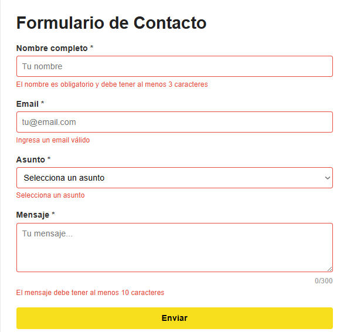
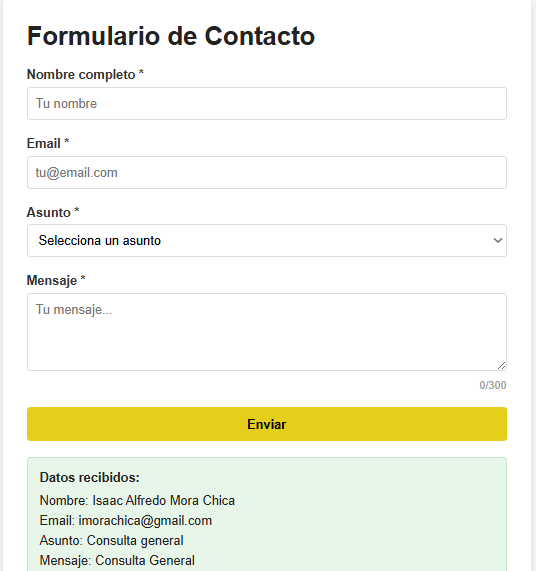
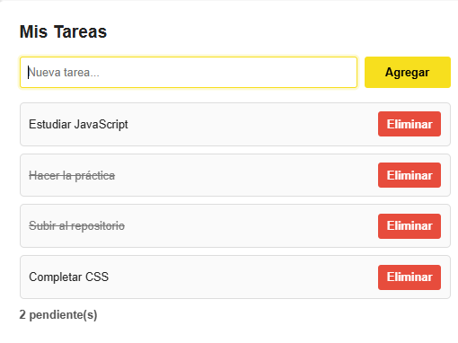
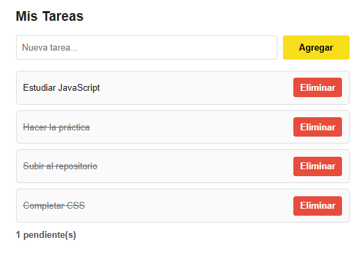
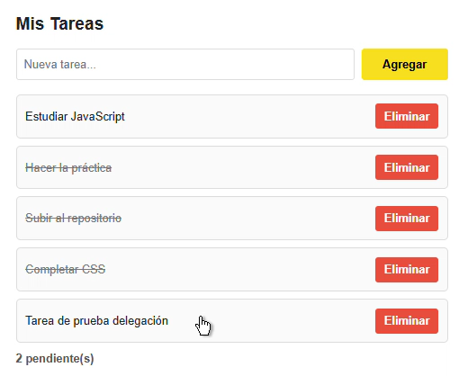

# Práctica DOM Básico - Gestión de Eventos

## 1. Descripción de la solución
Esta aplicación web permite gestionar una lista de tareas dinámica y un formulario de contacto mediante la manipulación del DOM con JavaScript. La solución se enfoca en la interactividad del usuario, validando datos en tiempo real y gestionando elementos creados dinámicamente de forma eficiente.

Principios aplicados:
- **Validación robusta**: Control de errores mediante expresiones regulares (Regex) y eventos de foco (`blur`).
- **Interactividad avanzada**: Uso de atajos de teclado y contadores en tiempo real.
- **Optimización de memoria**: Implementación de delegación de eventos para la lista de tareas.

---

## 2. Fragmentos de código destacados

### 2.1 Validación de formulario con `preventDefault()`
Para evitar que la página se recargue al enviar datos inválidos, se captura el evento `submit` y se detiene su comportamiento por defecto. Solo si todos los campos son válidos, se procesa la información.

```javascript
formulario.addEventListener('submit', (e) => {
    e.preventDefault(); // Detiene el envío automático

    const nombreValido = validarNombre();
    const emailValido = validarEmail();
    const asuntoValido = validarAsunto();
    const mensajeValido = validarMensaje();

    if (nombreValido && emailValido && asuntoValido && mensajeValido) {
        mostrarResultado();
        resetearFormulario();
    } else {
        // Focus en el primer campo con error
        if (!nombreValido) inputNombre.focus();
        else if (!emailValido) inputEmail.focus();
        // ...
    }
});

listaTareas.addEventListener('click', (e) => {
    const action = e.target.dataset.action; // Detecta si es 'eliminar' o 'toggle'
    if (!action) return;

    const item = e.target.closest('li');
    const id = Number(item.dataset.id);

    if (action === 'eliminar') {
        tareas = tareas.filter(t => t.id !== id);
    } else if (action === 'toggle') {
        const tarea = tareas.find(t => t.id === id);
        if (tarea) tarea.completada = !tarea.completada;
    }
    renderizarTareas();
});

document.addEventListener('keydown', (e) => {
    if (e.ctrlKey && e.key === 'Enter') {
        e.preventDefault();
        formulario.requestSubmit(); // Dispara el evento submit y sus validaciones
    }
});
```

## 3. Fragmentos de código destacados

### 3.1 Validación


### 3.2 Formulario enviado


### 3.3 Tarea agregada


### 3.4 Funcionamiento de contador


### 3.5 Delegación
