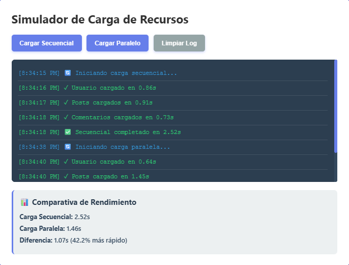
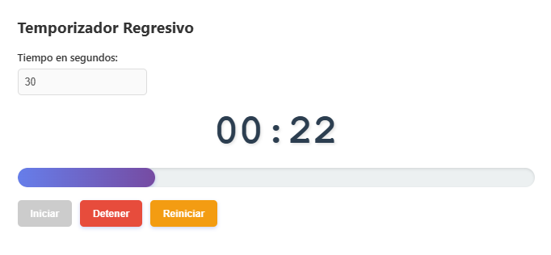
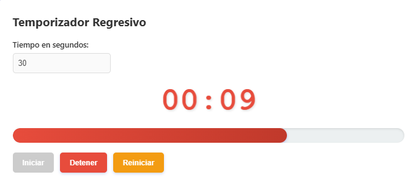
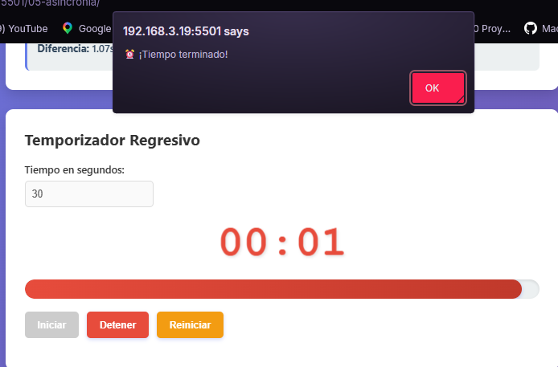
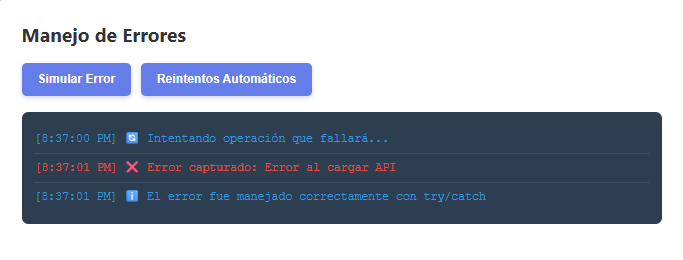
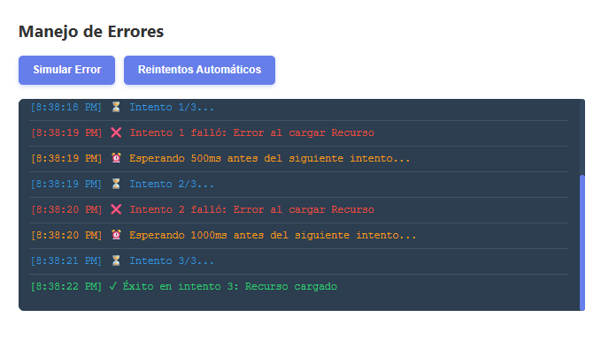

# Práctica de Asincronía y Flujo de Control en JavaScript

## 1. Descripción del Simulador
Este proyecto consiste en un simulador de procesos asíncronos que demuestra el manejo de peticiones a APIs, temporizadores y gestión de errores. La aplicación permite visualizar de forma práctica la diferencia de rendimiento entre procesos que se ejecutan uno tras otro (secuencial) y procesos que se ejecutan simultáneamente (paralelo), además de incluir un temporizador funcional con barras de progreso dinámicas.

---

## 2. Funciones Principales y Código Destacado

### 2.1 Carga Secuencial vs. Paralela
La diferencia fundamental radica en cómo el navegador gestiona el tiempo de espera. En el modo secuencial, cada petición debe terminar para que la siguiente comience. En el modo paralelo, todas se lanzan al mismo tiempo.

```javascript
// Ejemplo de Carga Paralela usando Promise.all
async function cargarParalelo() {
    const promesas = [
        simularPeticion('Usuario', 500, 1000),
        simularPeticion('Posts', 700, 1500),
        simularPeticion('Comentarios', 600, 1200)
    ];

    // Esperamos a que todas se resuelvan simultáneamente
    const resultados = await Promise.all(promesas);
}

intervaloId = setInterval(() => {
    tiempoRestante--;
    actualizarDisplay();

    if (tiempoRestante <= 0) {
        detener();
        alert('⏰ ¡Tiempo terminado!');
    }
}, 1000);

/* =========================
   MANEJO DE ERRORES
========================= */

// 1. Simulación básica de captura de error
async function simularError() {
    mostrarLogError('🔄 Intentando operación que fallará...', 'info');

    try {
        // Forzamos el fallo pasando el parámetro 'fallar' como true
        await simularPeticion('API', 500, 1000, true);
        mostrarLogError('✓ Operación exitosa', 'success');
    } catch (error) {
        // Capturamos el error generado en la promesa y lo mostramos en la UI
        mostrarLogError(`❌ Error capturado: ${error.message}`, 'error');
        mostrarLogError('ℹ️ El error fue manejado correctamente con try/catch', 'info');
    }
}

// 2. Lógica avanzada con Reintentos (Backoff Exponencial)
async function fetchConReintentos(nombre, intentos = 3) {
    for (let i = 0; i < intentos; i++) {
        try {
            mostrarLogError(`⏳ Intento ${i + 1}/${intentos}...`, 'info');
            
            // Simulación con probabilidad de fallo aleatoria
            return await simularPeticion(nombre, 500, 1000, Math.random() > 0.5);
            
        } catch (error) {
            mostrarLogError(`❌ Intento ${i + 1} falló: ${error.message}`, 'error');

            if (i < intentos - 1) {
                // Espera exponencial: aumenta el tiempo en cada fallo para no saturar
                const espera = Math.pow(2, i) * 500; 
                mostrarLogError(`⏰ Esperando ${espera}ms...`, 'warning');
                await new Promise(resolve => setTimeout(resolve, espera));
            }
        }
    }
    mostrarLogError(`💥 Todos los intentos fallaron para ${nombre}`, 'error');
    throw new Error(`Fallo tras ${intentos} intentos`);
}
```

## 3. Fragmentos de código destacados
### 3.1 Comparativa

### 3.2 Temporizador normal

### 3.3 Temporizador rojo

### 3.4 Temporizador con notificación

### 3.5 Error simulado

### 3.6 Reintentos automáticos
