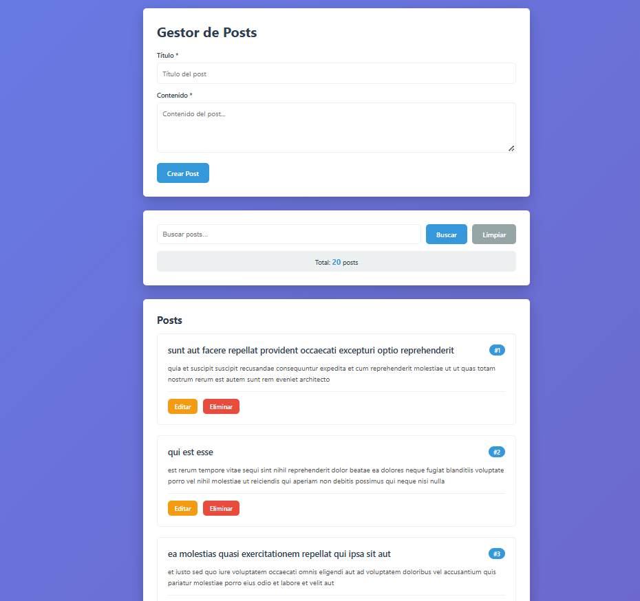
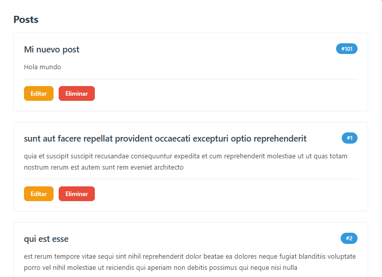
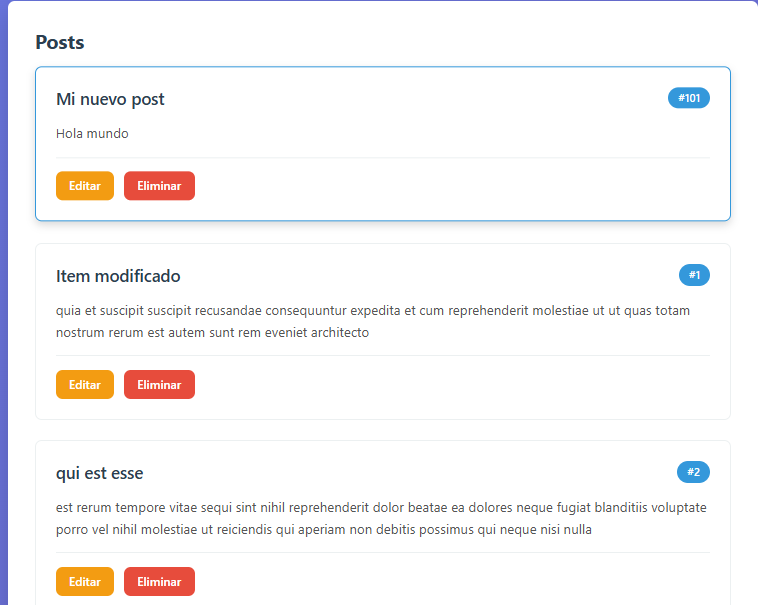
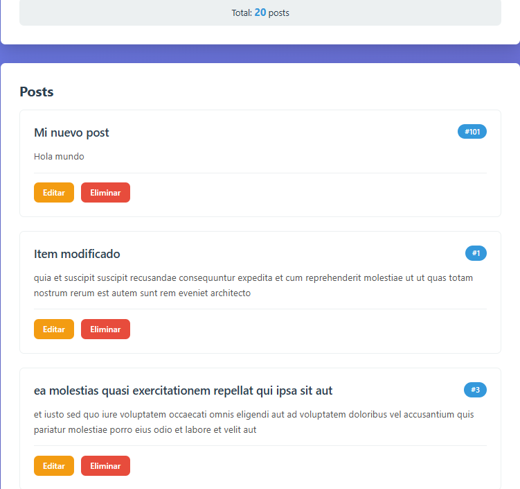
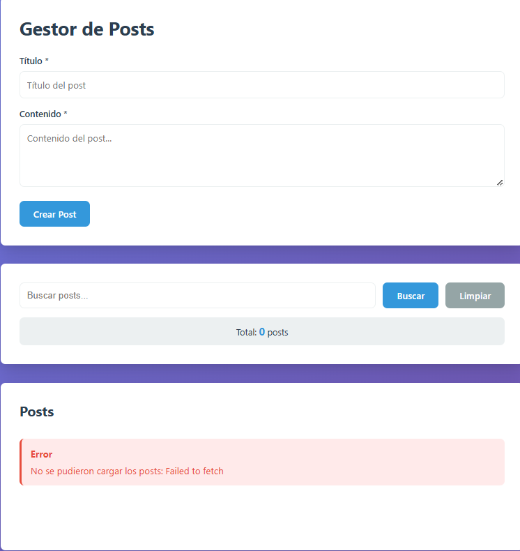
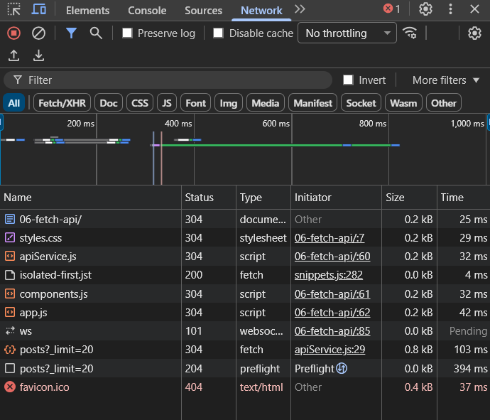
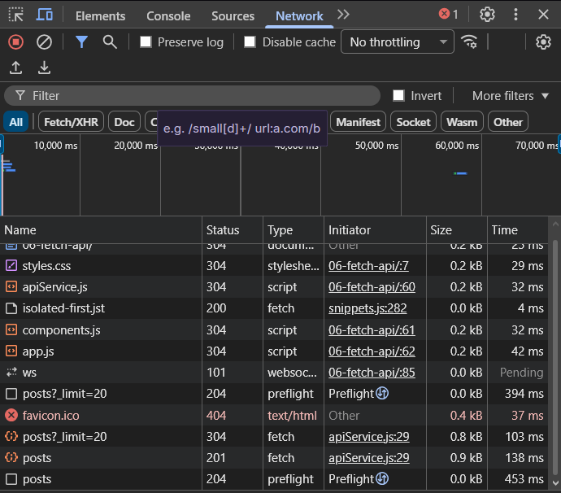

# Gestor de Posts - Fetch API Practice

Este proyecto es una aplicación web interactiva que permite gestionar publicaciones (posts) consumiendo la API de [JSONPlaceholder](https://jsonplaceholder.typicode.com/). Implementa todas las operaciones CRUD (Create, Read, Update, Delete) utilizando JavaScript asíncrono y manipulación del DOM.

## 🚀 Funcionalidades
- **Carga dinámica:** Obtención de los primeros 20 posts al iniciar.
- **Búsqueda en tiempo real:** Filtrado de posts por título o contenido.
- **Gestión de datos:** Creación, edición y eliminación de posts.
- **Feedback visual:** Mensajes de éxito/error y estados de carga (spinner).

## 📸 Evidencias de Funcionamiento

A continuación se detallan las capturas del sistema:

### Interfaz y Carga de Datos
| Estado de Carga | Lista de Posts Cargada |
| :---: | :---: |
|  |  |

### Operaciones CRUD
- **Creación:** 
- **Edición:** 
- **Eliminación:** 

### Manejo de Errores y Red
- **Mensaje de Error:** 
- **Petición GET:** 
- **Petición POST:** 

---

## 🛠️ Fragmentos de Código Relevantes

### 1. Servicio de API (Consumo Genérico)
Se implementó un método `request` asíncrono dentro de `ApiService` para centralizar todas las llamadas `fetch` y manejar errores de forma global.

```javascript
async request(endpoint, options = {}) {
    const url = `${this.baseUrl}${endpoint}`;
    const config = {
        headers: {
            'Content-Type': 'application/json',
            ...options.headers
        },
        ...options
    };

    try {
        const response = await fetch(url, config);
        if (!response.ok) {
            throw new Error(`HTTP Error: ${response.status} ${response.statusText}`);
        }
        if (response.status === 204) return null;
        return await response.json();
    } catch (error) {
        console.error("Error en la petición:", error);
        throw error;
    }
}

async function cargarPosts() {
    try {
        mostrarCargando(listaPosts);
        posts = await ApiService.getPosts(20);
        postsFiltrados = [...posts];
        renderizarPosts(postsFiltrados, listaPosts);
        actualizarContador();
    } catch (error) {
        listaPosts.innerHTML = '';
        listaPosts.appendChild(MensajeError(`No se pudieron cargar los posts: ${error.message}`));
    }
}