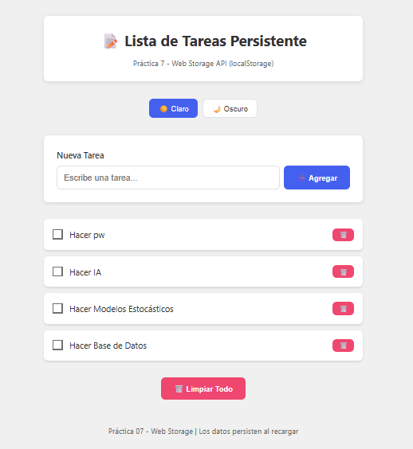
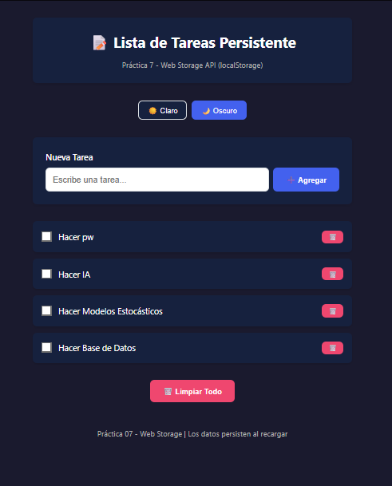
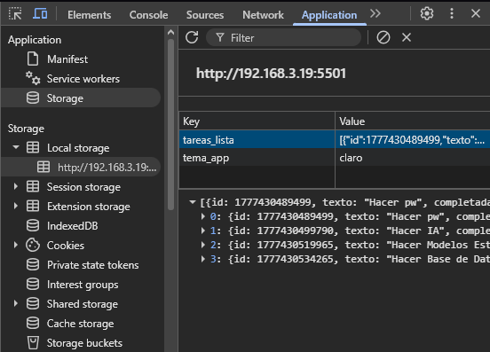

# Gestor de Tareas Persistente - Web Storage Practice

Este proyecto es una aplicación web interactiva diseñada para la gestión de tareas diarias. Su característica principal es el uso de la **Web Storage API** (`localStorage`), lo que permite que la información y las preferencias del usuario (como el tema visual) persistan incluso después de cerrar o recargar el navegador.

## 🚀 Funcionalidades
- **Persistencia de Tareas:** Guardado automático de la lista de tareas en formato JSON.
- **Cambio de Tema Dinámico:** Alternancia entre modo claro y oscuro con guardado de preferencia.
- **Gestión Completa (CRUD):** Creación, marcado de completado y eliminación de registros.
- **Validaciones de Usuario:** Confirmaciones antes de eliminar datos críticos para evitar pérdidas accidentales.

---

## 📸 Evidencias de Funcionamiento


### Interfaz y Modos Visuales
| Lista de Tareas (Tema Claro) | Modo Oscuro Aplicado |
| :---: | :---: |
|  |  |

### Inspección de Datos
| Registro en LocalStorage |
| :---: |
|  |

---

## 🛠️ Fragmentos de Código Relevantes

### 1. Servicio de Persistencia (`storage.js`)
Se utilizó un objeto literal para encapsular toda la lógica de `localStorage`. El método `crear` destaca por la generación de IDs únicos mediante *timestamps* y la serialización de objetos.

```javascript
/**
 * Crea una nueva tarea y la persiste en el storage.
 * @param {string} texto - Contenido de la tarea.
 */
crear(texto) {
    const tareas = this.getAll(); // Obtiene el array actual
    
    const nuevaTarea = {
        id: Date.now(), // ID único basado en milisegundos
        texto: texto.trim(),
        completada: false
    };

    tareas.push(nuevaTarea);
    this.guardar(tareas); // Convierte a JSON y guarda
    return nuevaTarea;
}

/**
 * Elimina una tarea tras la confirmación del usuario.
 */
function eliminarTarea(id) {
    const tarea = tareas.find(t => t.id === id);
    
    // Validación de seguridad antes de modificar el storage
    if (tarea && confirm(`¿Estás seguro de eliminar "${tarea.texto}"?`)) {
        TareaStorage.eliminar(id);
        tareas = TareaStorage.getAll(); // Sincronización de estado local
        renderizarTareas(); // Actualización de la interfaz
    }
}