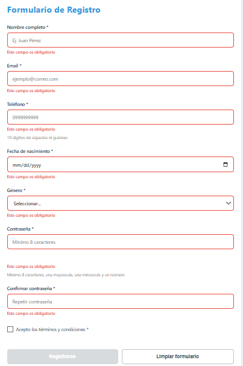
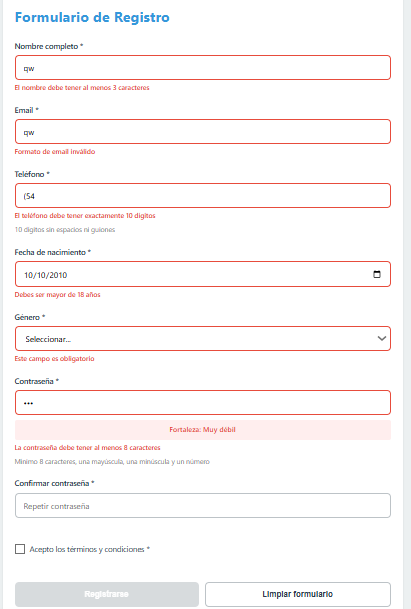
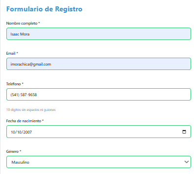
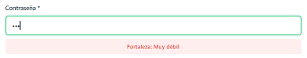
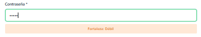
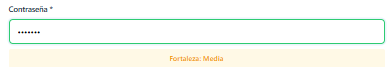
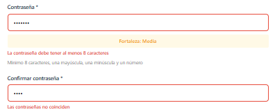
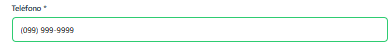
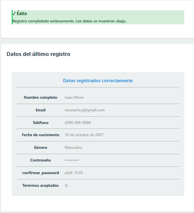
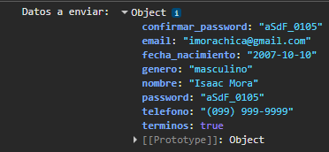

# Sistema de Validación de Formularios y Componentes - Práctica 07

Este proyecto consiste en el desarrollo de un **Servicio de Validación Avanzado** para formularios web. La solución implementa una arquitectura desacoplada donde la lógica de validación reside en un objeto de servicio (ValidacionService), permitiendo que el código sea mantenible, escalable y fácil de testear.

---

## 📸 Evidencias de Funcionamiento

A continuación, se presentan las capturas de pantalla que demuestran el comportamiento del sistema ante diferentes escenarios de uso y validación. Todas las imágenes se encuentran almacenadas en la carpeta `/assets`.

### 1. Estados Globales del Formulario
| Formulario Inicial | Campos con Errores | Validación Exitosa |
| :---: | :---: | :---: |
|  |  |  |

### 2. Evaluación de Seguridad (Password Strength)
El sistema analiza la complejidad de la contraseña en tiempo real mientras el usuario escribe.

| Nivel: Muy Débil | Nivel: Débil | Nivel: Media |
| :---: | :---: | :---: |
|  |  |  |

### 3. Validaciones de Cotejo y Máscaras
| Contraseñas No Coinciden | Máscara de Teléfono |
| :---: | :---: |
|  |  |

### 4. Resultados y Depuración
| Confirmación de Envío | Registro en Consola |
| :---: | :---: |
|  |  |

---

## 📝 Descripción de la Solución

La solución se basa en tres pilares fundamentales:

1.  **Validación Basada en Reglas (Regex):** Se utiliza un objeto centralizado de expresiones regulares para validar formatos críticos como correos electrónicos, números telefónicos de 10 dígitos y contraseñas seguras.
2.  **Experiencia de Usuario (UX) Proactiva:** El sistema no solo valida al enviar el formulario, sino que proporciona retroalimentación en tiempo real. Incluye una **máscara dinámica para el teléfono** que formatea la entrada mientras el usuario escribe y un **evaluador de fuerza de contraseña** que visualiza la complejidad mediante clases CSS.
3.  **Gestión de Estados de Error:** Se implementó una lógica de "limpieza y marcado" donde los campos cambian su estilo visual (bordes rojos/verdes) y muestran mensajes descriptivos específicos, mejorando la accesibilidad y comprensión del usuario.

---

## 🛠️ Fragmentos de Código Clave

### Servicio de Validación Centralizado
Este método es el motor que procesa cada campo individualmente según su atributo `name`.

```javascript
validarCampo(campo) {
    const valor = campo.value.trim();
    const nombre = campo.name;
    let error = '';

    // Validación de obligatoriedad
    if (campo.hasAttribute('required') && !valor) {
        error = 'Este campo es obligatorio';
    }

    // Validaciones por tipo de dato
    if (valor) {
        switch (nombre) {
            case 'email':
                if (!REGEX.email.test(valor)) error = 'Formato de email inválido';
                break;
            case 'telefono':
                if (!REGEX.telefono.test(valor.replace(/\D/g, ''))) 
                    error = 'El teléfono debe tener 10 dígitos';
                break;
            case 'password':
                if (valor.length < 8) error = 'Mínimo 8 caracteres';
                break;
        }
    }
    return { valido: error === '', error };
}